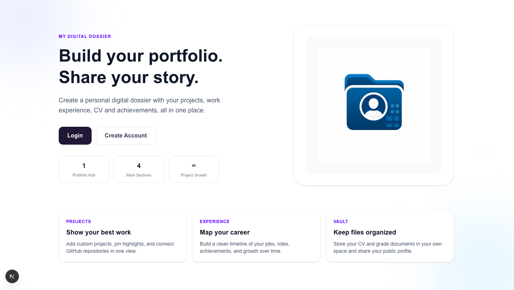
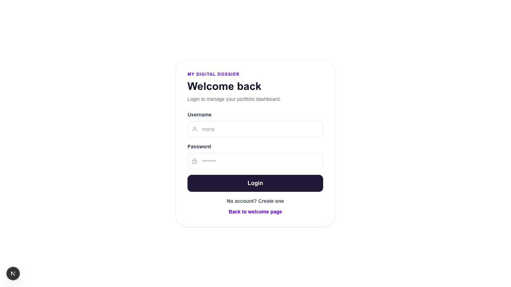
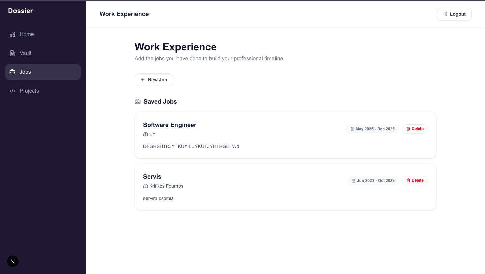
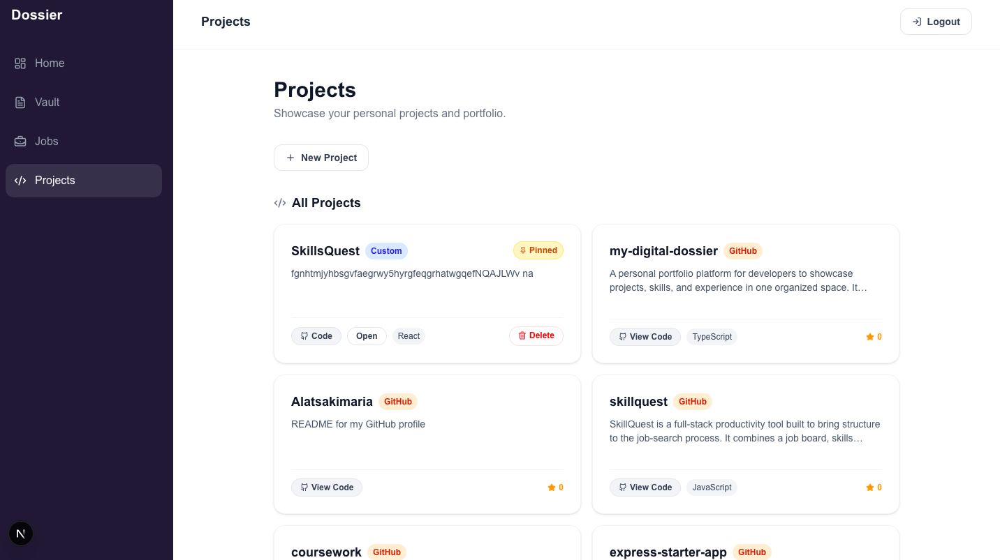
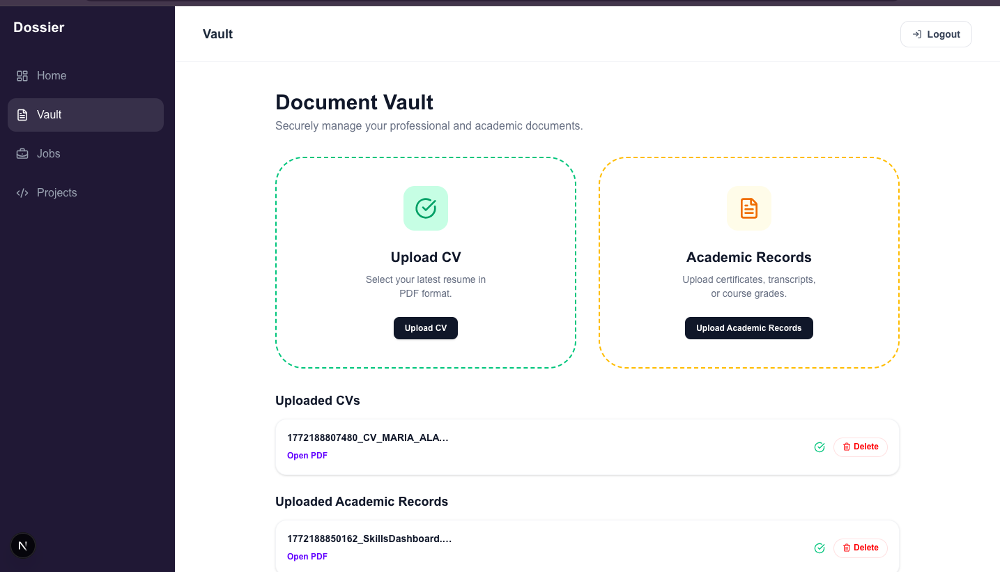

# My Digital Dossier

Portfolio web app built with Next.js + Supabase.

## What it is

My Digital Dossier is a focused portfolio workspace where a user can:

- build a public-ready profile,
- manage jobs and projects,
- import GitHub repositories,
- upload personal documents (CV + grades),
- and present a clean portfolio dashboard.

## Current User Flow

- `/` → public welcome page with branding/logo and CTAs.
- `/login` → login form.
- `/login?mode=signup` → create-account form directly.
- `/dashboard` → authenticated app area (Dashboard, Jobs, Projects, Vault).

## Core Features

- Welcome page with subtle animations and brand/logo block.
- Local auth for testing (`username`, `full_name`, `password`).
- Dashboard overview with editable profile details.
- Jobs management with modern month/year date inputs.
- Projects management:
	- create/edit/delete,
	- image upload + gallery,
	- pin/unpin featured projects,
	- GitHub repo import from a dedicated GitHub username.
- Vault management:
	- CV files stored per user in `cvs/<username>/...`,
	- grade files stored per user in `grades/<username>/...`.
- Public profile route: `/profile/[username]`.

## Screenshots

### Welcome Page



### Login / Signup




### Work Experience



### Projects Tab



### Vault Tab



## GitHub Connection

GitHub project import is **decoupled** from app username.

- Set `github_username` in profile settings.
- If missing, app can fall back to parsing `github_url`.
- Projects tab imports repos from that GitHub account.

## Auth Model (Current)

Testing auth is implemented with a `local_users` table + browser local session storage.

- Signup: `username`, `full_name`, `password`
- Login: `username`, `password`
- Local session key: `dossier_local_user`

⚠️ This is a testing setup and **not production secure** (plain password storage).

## Tech Stack

- Next.js 16 (App Router)
- React 19
- TypeScript
- Tailwind CSS v4
- Supabase (Postgres + Storage)

## Local Development

1. Install dependencies

```bash
npm install
```

2. Create `.env.local`

```bash
NEXT_PUBLIC_SUPABASE_URL=your_supabase_project_url
NEXT_PUBLIC_SUPABASE_ANON_KEY=your_supabase_anon_key
```

3. Add your landing logo (optional but recommended)

- Place your logo at `public/logo.png`.

4. Run app

```bash
npm run dev
```

5. Open `http://localhost:3000`

## Supabase Setup

Run these SQL files in Supabase SQL Editor.

### Required (current app)

- [sql/2026-02-25-project-images.sql](sql/2026-02-25-project-images.sql)
- [sql/2026-02-25-profile-settings.sql](sql/2026-02-25-profile-settings.sql)
- [sql/2026-02-25-project-pinning.sql](sql/2026-02-25-project-pinning.sql)
- [sql/2026-02-26-storage-policies.sql](sql/2026-02-26-storage-policies.sql)
- [sql/2026-02-26-local-users.sql](sql/2026-02-26-local-users.sql)
- [sql/2026-02-27-profile-github-username.sql](sql/2026-02-27-profile-github-username.sql)

### Optional / legacy experiments

- [sql/2026-02-26-app-users-auth.sql](sql/2026-02-26-app-users-auth.sql)
- [sql/2026-02-26-user-ownership-backfill.sql](sql/2026-02-26-user-ownership-backfill.sql)

## Storage

Required bucket: `dossier-files`

Policies are defined in:
- [sql/2026-02-26-storage-policies.sql](sql/2026-02-26-storage-policies.sql)

## Scripts

- `npm run dev` → development server
- `npm run build` → production build
- `npm run start` → production server
- `npm run lint` → ESLint
- `npm run test:e2e` → Playwright smoke suite
- `npm run test:e2e:ui` → Playwright UI mode

## QA Portfolio Evidence

If you are reviewing this project from a QA perspective, see:

- [docs/qa/TEST_PLAN.md](docs/qa/TEST_PLAN.md)
- [docs/qa/TEST_CASES.md](docs/qa/TEST_CASES.md)
- [docs/qa/BUG_REPORTS.md](docs/qa/BUG_REPORTS.md)
- [docs/qa/QA_EXECUTION_REPORT.md](docs/qa/QA_EXECUTION_REPORT.md)
- [docs/qa/postman/MyDigitalDossier_QA.postman_collection.json](docs/qa/postman/MyDigitalDossier_QA.postman_collection.json)

Quick verification commands:

```bash
npm run lint
npm run build
npm run test:e2e
```

## Recommended Next Step

Move from local testing auth to secure auth:

- hash passwords,
- enforce strict per-user RLS,
- and replace localStorage sessions with secure server/session auth.


## License

This project is licensed under the MIT License - see the [License](LICENSE) file for details.
